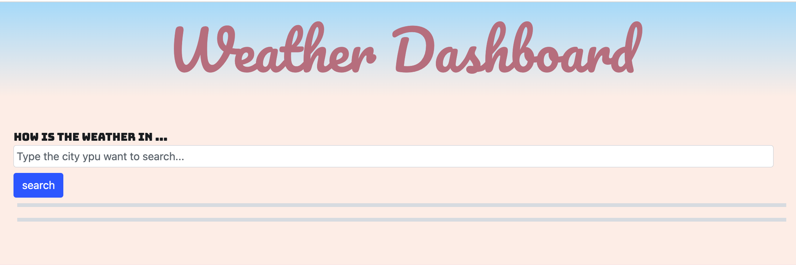
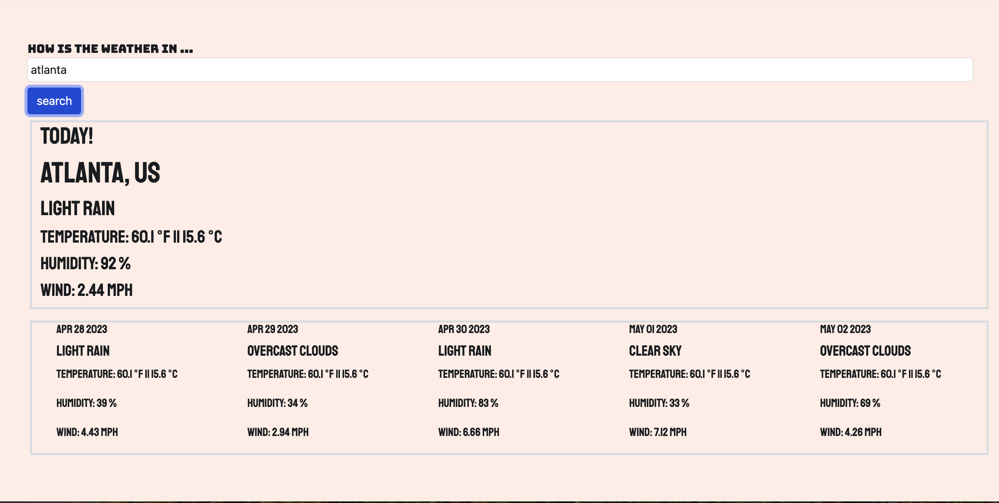

# 06 Server-Side APIs: Weather Dashboard

##  Task

Third-party APIs allow developers to access their data and functionality by making requests with specific parameters to a URL.
Developers are often tasked with retrieving data from another application's API and using it in the context of their own.
for this proyect I used [5 Day Weather Forecast](https://openweathermap.org/forecast5) to retrieve weather data for cities.
## User
```
any person will be ble to see the weather outlook for multiple cities, this will be able to display the weather for the current day and the 5 following days.
```


## Mock-Up

a weather dashboard with form inputs to search for a city.
(this is what will appear a soon as you open this weather channel)



I view current weather conditions for the city input.
(this is what will appear a soon as you open this weather channel.)


